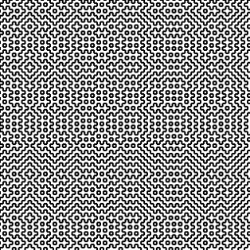

# Gitomezashi

Hitomezashi Stitch Patterns for git commit hashes

## Source

[The Numberphile Video](https://www.youtube.com/watch?v=JbfhzlMk2eY)

## How it works

1. we take the commit hash of the head

2. we split it in two (the vertical and horizontal parts)

3. we look bit by bit each part and draw the lines accordingly

## Usage

```sh
# for the current repo
gitomezashi

# or
gitomezashi [PATH]
```

## Example

For the commit `c5a274f873ea206a73554a60ed706fc6ab22ac12`, we got the following:



## For Nix Users

```sh
nix shell github:GuilloteauQ/gitomezashi
```

